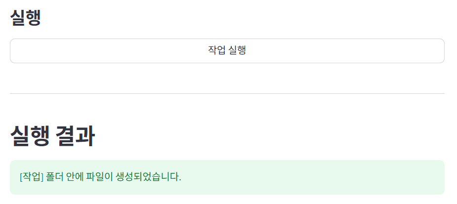
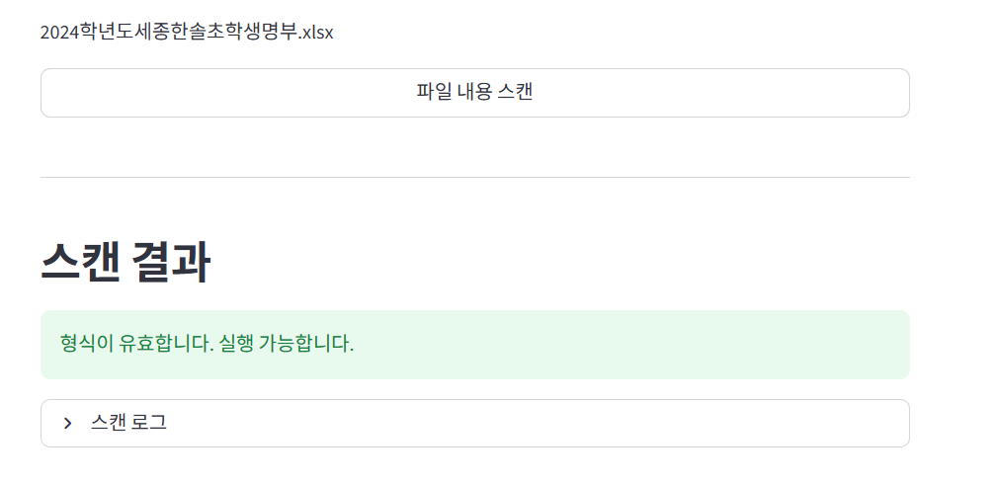
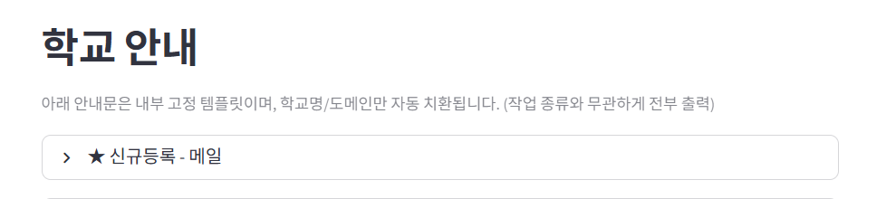
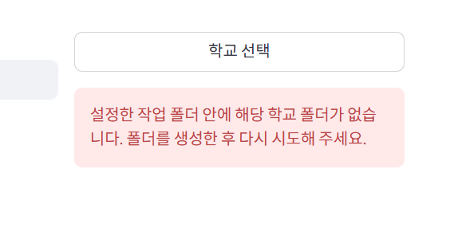

실행 결과 출력 서식 변경 필요

버튼 위치 동일하게 맞추기

학교명 입력하고 엔터를 친 다음 학교 선택을 누르는 동작이 불필요함. 밑에 따로 칸을 만들지 말고 자동완성처럼 DB 기반의 값들을 띄워주고 그때부터는 사용자가 드롭다운처럼 고를 수 있도록 하는 것은? 그 다음 적용 누르고 색상 박스 안내처럼 학교가 선택되었습니다 or 해당 학교의 폴더가 존재하지 않습니다 리액션 보여주기

타이틀도 학교 말고 학교 선택 이렇게 할까? 선택 뺄까?

스캔 결과랑 실행이 등위여야 하는 것 아닌가? 구분선을 놓든 실행 크기를 키우든 해야지

오히려 스캔 결과 밑에 구분선 있고 실행이랑 실행 결과가 이어지는 게 좋아 보이는데

그럴 거면 위에서 스캔 버튼이랑 스캔 결과도 구분선 없이 이어지게 해야 하나?

학교 안내라는 타이틀보다 더 적절한 것 없나 텍스트라든가 문구라든가 안내문? 글자의 느낌이 났으면 하는데

그리고 이런 회색 글씨가 조금 더 진하고 조금 더 컸으면 좋겠음

안내문에서 밑의 공백이랑 구분선은 없어도 될듯. 텍스트에서 텍스트까지만.

<<<<<<< HEAD
오류 창 이렇게 하지 말고 밑에 길게.
=======
오류 창 이렇게 하지 말고 밑에 길게.

20260224
사이드바를 만들어서 최초1회 설정은 저장하는 것 어떨까?
탭으로구분하는것이나을까?

>>>>>>> 0f1c56e (20260227)
