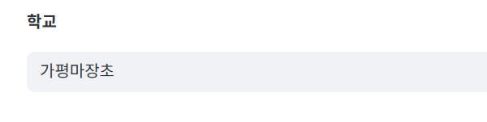

적용 버튼의 레이아웃을 통일하는 게 좋지 않을까? 오른쪽에 작게가 나을지 아래가 나을지.

지금 회색 박스 위 폰트 서식들도 다 다르고.

지금 아무것도 안 해도 학교 박스가 채워져 있는데 처음에는 여기 키워드를 입력해 주세요 라든가 학교명을 입력해 주새요 라든가 텍스트를 입력할 수 있는 공간이라는 지표가 있어야 할듯

이렇게 로그에서 학생명부가 없다고 뜨는데 오류 메세지는 형식 이야기를 하고 있음 

안내문 내용들 칸 글자 크기에 맞추자........
그리고 박스 위에 내용이라는 텍스트가 굳이 필요한가?