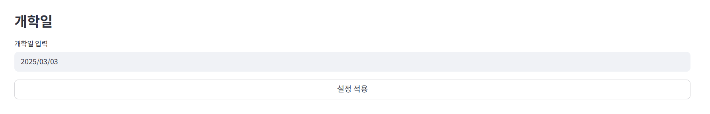
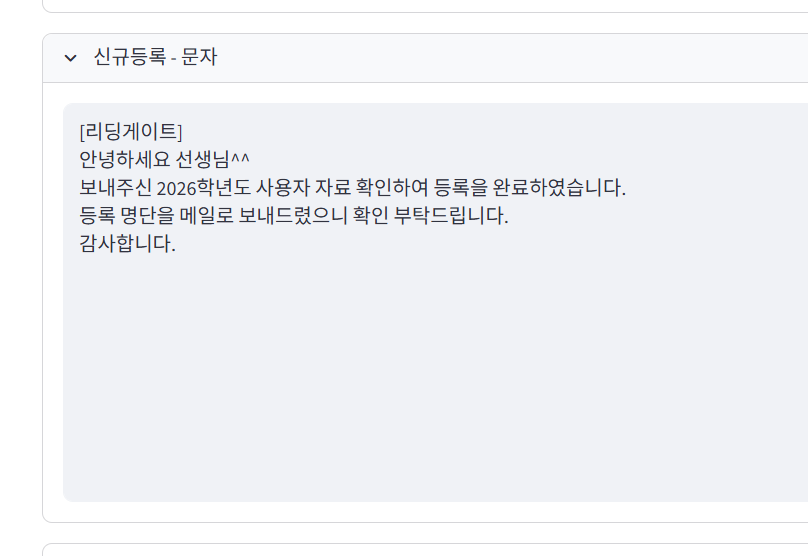
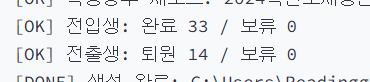
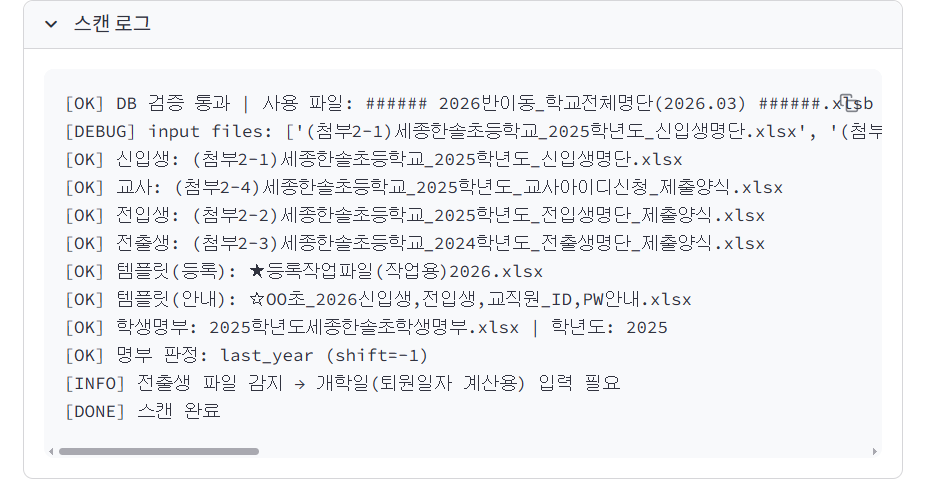

여기 박스 위에 개학일 입력 텍스트가 필요한가? 

적용 박스가 개학일 아래에 너무 붙어 있어서 이 최초 설정 전체를 저장한다는 느낌이 안 듦 차라리 조금 띄우고 설정 저장 이라고 하는 게 나을듯 통일성을 위해 개학일 옆에도 적용 버튼 오른쪽에 작게 만들고
전체 저장 버튼은 따로

여기 생성된 파일 타이틀이 삽입되는 게 어색함. 꼭 필요한가? 그리고 목록 앞에 점 서식 빼자. 저장 위치는 파일 이름 서식이랑 통일되어도 될 듯.

여기 텍스트 길이랑 박스 크기 맞추라는 건 왜 죽어도 안 맞추는지?

리액션 메세지 토스트 버전으로 바꾸기.

보류 메세지는 로그 바깥으로

셀 길이 텍스트 크기에 맞추기

안내문 날짜도 개학일 기준으로 맞추기

텍스트 파일 참고하는 방식으로 바꾸기

년도파일판정로직검토 >>>> 명부 작년 학년도로 고정

검토 방안 넣기........ 명부는작년것으로고정하기

